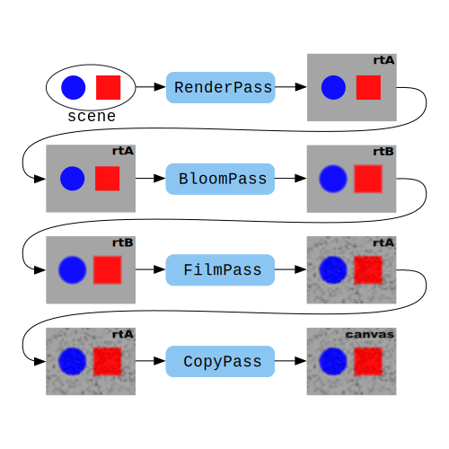

[文档地址](https://threejs.org/manual/#zh/post-processing)
[demo地址](https://threejs.org/docs/index.html#examples/zh/postprocessing/EffectComposer)
后置处理通常是指应用到2d图像上的某种特效或者是滤镜。一般来说，图像被直接渲染成 `canvas` 然后在浏览器中被展示,然而在结果被输出到`canvas` 之前，我们也可以通过另外的一个 `render target` 并应用一些后置效果。这被称为 **后期处理**，因为它发生在**主场景渲染过程之后**。
+ 工作方式：创建 `EffectComposer` 然后增加一些 `Pass` 对象。
+ 工作方法：创建两个 `render targets` rtA和rtB。然后你调用`EffectComposer.addPass` 按照你想要应用它们的顺序增加 `pass`。


**解释:**  首先， 你传入RenderPass的场景被渲染到rtA，不管rta的内容是啥，它继续向下一个pass传递。下一个pass将它作为输入做一些操作然后将其写入到rtB。然后rtB传到下一个pass,将rtB作为输入作一些操作然后在写回rtA。这个过程在整个pass过程中持续发生。

每个 `pass` 都有4个基础选项
+ `enabled`: 是否使用这个 `pass`。
+ `needsSwap`: 完成这个 `pass` 后是否交换rtA和rtB。
+ `clear`: 在渲染这个 `pass` 之前是否需要清除。
+ `renderToScreen`: 是否将当前的内容渲染到画布上。通常来说你需要在你最后添加的pass设置这一项为`true`。

常见的几种 `pass`
+  BloomPass:  将它的输入放入一个通常来说更小的 `render target`然后对这个结果的表面进行模糊处理。这使得scene产生辉光效果。
```js
const bloomPass = new BloomPass(
    1,    // strength
    25,   // kernel size
    4,    // sigma ?
    256,  // blur render target resolution
);
composer.addPass(bloomPass);
```
+ FilmPass: 添加噪点和扫描线。
```js
const filmPass = new FilmPass(
    0.35,   // noise intensity
    0.025,  // scanline intensity
    648,    // scanline count
    false,  // grayscale
);
// filmPass.renderToScreen = true;
composer.addPass(filmPass);
...
composer.render(deltaTime);//EffectComposer.render 需要花费deltaTime自最后一帧渲染后的数秒时间


```
