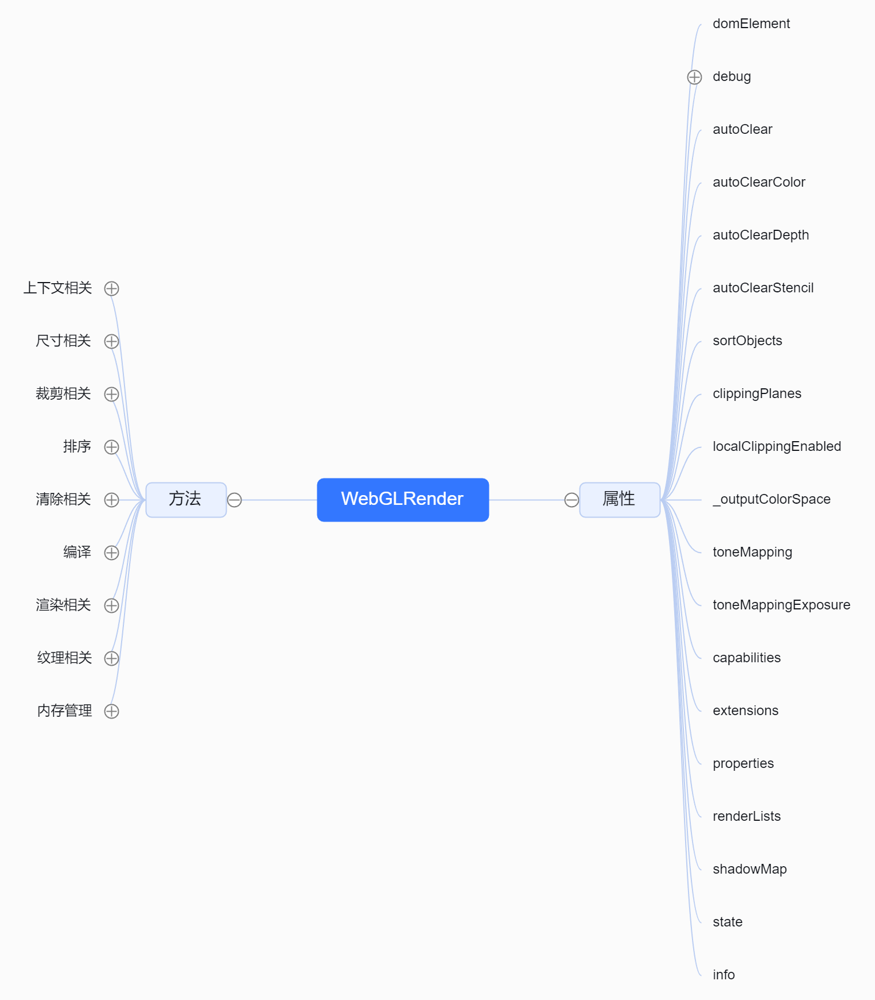
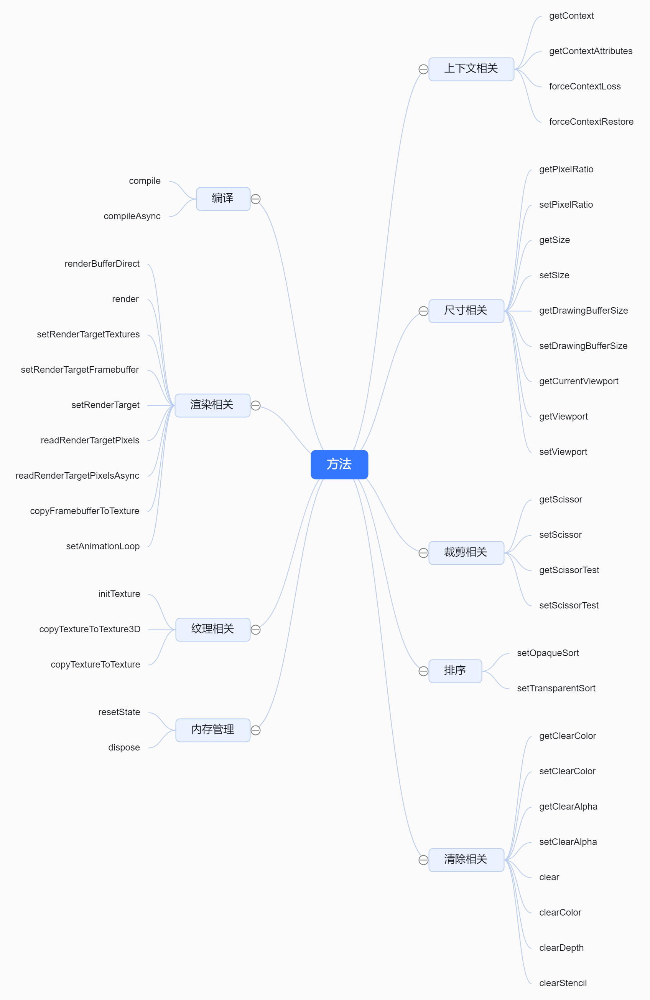
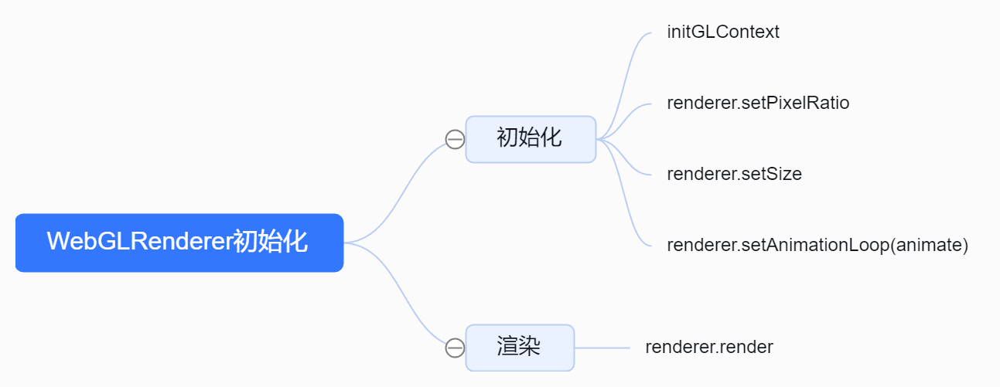
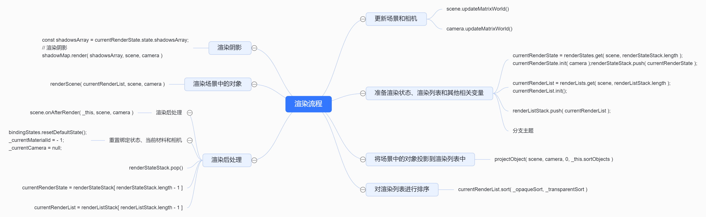

该类是说是threejs的核心也不为过。

## 1. WebGLRender的整体结构


`WebGLRender`方法总结




## 2. WebGLRenderer的运行结构


### 2.1. 初始化WebGL上下文
#### 2.1.1. initGLContext的源码实现
```js
let extensions, capabilities, state, info;
let properties, textures, cubemaps, cubeuvmaps, attributes, geometries, objects;
let programCache, materials, renderLists, renderStates, clipping, shadowMap;
let background, morphtargets, bufferRenderer, indexedBufferRenderer;
let utils, bindingStates, uniformsGroups;
/**
 * 初始化WebGL上下文
 */
function initGLContext() {
	// 初始化 WebGL 扩展
	extensions = new WebGLExtensions(_gl);
	extensions.init();

	// 初始化 WebGL 实用工具
	utils = new WebGLUtils(_gl, extensions);

	// 初始化 WebGL 功能
	capabilities = new WebGLCapabilities(_gl, extensions, parameters, utils);

	// 初始化 WebGL 状态 颜色、深度、混合等缓冲区 纹理等
	state = new WebGLState(_gl);

	// 初始化 WebGL 信息 如调用次数、点线面的数量，几何图形的数量，纹理的数量
	info = new WebGLInfo(_gl);
	// 初始化 WebGL 属性
	properties = new WebGLProperties();

	// 初始化 WebGL 纹理
	textures = new WebGLTextures(_gl, extensions, state, properties, capabilities, utils, info);
	// 初始化 WebGL 立方体纹理
	cubemaps = new WebGLCubeMaps(_this);
	// 初始化 WebGL 立方体 UV 纹理
	cubeuvmaps = new WebGLCubeUVMaps(_this);

	// 初始化 WebGL 属性 用于处理 WebGL 中的属性缓冲,主要是处理以下代码的逻辑
	/**
	 * 	const buffer = gl.createBuffer();
		gl.bindBuffer( bufferType, buffer );
		gl.bufferData( bufferType, array, usage );
		*/
	attributes = new WebGLAttributes(_gl);
	// 初始化 WebGL 绑定状态, 主要是执行以下代码的逻辑
	/**
	 *  //缓冲区中的数据按照一定的规律传递给位置变量apos
		gl.vertexAttribPointer(aposLocation, 3, gl.FLOAT, false, 0, 0);
		//允许数据传递
		gl.enableVertexAttribArray(aposLocation);
		*/
	bindingStates = new WebGLBindingStates(_gl, attributes);

	// 初始化 WebGL 几何体  
	// 主要处理attributes里面的属性，并释放bindingStates的内存
	geometries = new WebGLGeometries(_gl, attributes, info, bindingStates);
	// 初始化 WebGL 对象 用于操作object的
	objects = new WebGLObjects(_gl, geometries, attributes, info);

	// 初始化 WebGL 变形目标
	morphtargets = new WebGLMorphtargets(_gl, capabilities, textures);
	// 初始化 WebGL 裁剪
	clipping = new WebGLClipping(properties);

	// 初始化 WebGL 程序缓存  可以看成是如下代码
	/**
	 *  function createShader(gl, type, source) {
			const shader = gl.createShader(type);
			gl.shaderSource(shader, source);
			gl.compileShader(shader);
			const success = gl.getShaderParameter(shader, gl.COMPILE_STATUS);
			if (success) {
				return shader;
			}
			console.log(gl.getShaderInfoLog(shader));
			gl.deleteShader(shader);
		}
		function createProgram(gl, vertexShader, fragmentShader) {
			const program = gl.createProgram();
			gl.attachShader(program, vertexShader);
			gl.attachShader(program, fragmentShader);
			gl.linkProgram(program);
			const success = gl.getProgramParameter(program, gl.LINK_STATUS);
			if (success) {
				return program;
			}
			console.log(gl.getProgramInfoLog(program));
			gl.deleteProgram(program);
		}
		*/
	programCache = new WebGLPrograms(_this, cubemaps, cubeuvmaps, extensions, capabilities, bindingStates, clipping);
	// 初始化 WebGL 材质 主要是将material上的属性赋值到uniforms上
	materials = new WebGLMaterials(_this, properties);

	// 初始化 WebGL 渲染列表 存储渲染数据用的
	renderLists = new WebGLRenderLists();
	// 初始化 WebGL 渲染状态 主要是处理跟光源相关的代码
	renderStates = new WebGLRenderStates(extensions);

	// 初始化 WebGL 背景 实际上是调用 gl.clearColor( r, g, b, a );
	background = new WebGLBackground(_this, cubemaps, cubeuvmaps, state, objects, _alpha, premultipliedAlpha);
	// 初始化 WebGL 阴影贴图
	shadowMap = new WebGLShadowMap(_this, objects, capabilities);

	// 初始化 WebGL 均匀变量组
	uniformsGroups = new WebGLUniformsGroups(_gl, info, capabilities, state);

	// 初始化 WebGL 缓冲区渲染器 主要执行 gl.drawArrays( mode, start, count )和gl.drawArraysInstanced( mode, start, count, primcount );
	bufferRenderer = new WebGLBufferRenderer(_gl, extensions, info);
	// 初始化 WebGL 索引缓冲区渲染器 主要执行 gl.drawElements( mode, count, type, start * bytesPerElement )和gl.drawElementsInstanced( mode, count, type, start * bytesPerElement, primcount );
	indexedBufferRenderer = new WebGLIndexedBufferRenderer(_gl, extensions, info);

	// 设置 WebGLInfo 的 programs 属性
	info.programs = programCache.programs;

	// 设置 this 的属性
	_this.capabilities = capabilities;
	_this.extensions = extensions;
	_this.properties = properties;
	_this.renderLists = renderLists;
	_this.shadowMap = shadowMap;
	_this.state = state;
	_this.info = info;
}
```
### 2.2. 循环动画的实现
* 业务代码
```js
renderer.setAnimationLoop( animate )
...
function animate() {
    ...
    renderer.render( scene, camera );

}
```
* WebGLRenderer中实现动画源码
```js
// Animation Loop
let onAnimationFrameCallback = null;
function onAnimationFrame( time ) {  
    if ( onAnimationFrameCallback ) onAnimationFrameCallback( time );
}
//动画类，在里面
const animation = new WebGLAnimation();
animation.setAnimationLoop( onAnimationFrame );
// 业务层面调用的代码
this.setAnimationLoop = function ( callback ) {
    onAnimationFrameCallback = callback;
    xr.setAnimationLoop( callback );
    ( callback === null ) ? animation.stop() : animation.start();
};
```
* WebGLAnimation源码
```js
function WebGLAnimation() {
	let context = null;
	let isAnimating = false;
	let animationLoop = null;
	let requestId = null;
	function onAnimationFrame( time, frame ) {
		animationLoop( time, frame );
		requestId = context.requestAnimationFrame( onAnimationFrame );
	}
	return {
		start: function () {
			if ( isAnimating === true ) return;
			if ( animationLoop === null ) return;
			requestId = context.requestAnimationFrame( onAnimationFrame );
			isAnimating = true;
		},
		stop: function () {
			context.cancelAnimationFrame( requestId );
			isAnimating = false;
		},
		setAnimationLoop: function ( callback ) {
			animationLoop = callback;
		},
		setContext: function ( value ) {
			context = value;
		}
	};
}
export { WebGLAnimation };
```
### 2.3. 渲染流程
#### 2.3.1. render的源码实现
```js
this.render = function ( scene, camera ) {
	// 检查输入
	if ( camera !== undefined && camera.isCamera !== true ) {
		console.error( 'THREE.WebGLRenderer.render: camera is not an instance of THREE.Camera.' );
		return;
	}
	if ( _isContextLost === true ) return;
	// 更新场景和相机矩阵
	// update scene graph
	if ( scene.matrixWorldAutoUpdate === true ) scene.updateMatrixWorld();
	// update camera matrices and frustum
	if ( camera.parent === null && camera.matrixWorldAutoUpdate === true ) camera.updateMatrixWorld();
	// XR（扩展现实）支持
	if ( xr.enabled === true && xr.isPresenting === true ) {
		if ( xr.cameraAutoUpdate === true ) xr.updateCamera( camera );
		camera = xr.getCamera(); // use XR camera for rendering
	}
	//场景和相机的其他准备
	if ( scene.isScene === true ) scene.onBeforeRender( _this, scene, camera, _currentRenderTarget );
	// 准备渲染状态、渲染列表和其他相关变量
	currentRenderState = renderStates.get( scene, renderStateStack.length );
	currentRenderState.init( camera );
	renderStateStack.push( currentRenderState );
	// 根据相机投影矩阵和逆世界矩阵计算投影屏幕矩阵
	_projScreenMatrix.multiplyMatrices( camera.projectionMatrix, camera.matrixWorldInverse );
	// 根据投影屏幕矩阵设置视锥体
	_frustum.setFromProjectionMatrix( _projScreenMatrix );
	// 初始化裁剪功能（如果启用）
	_localClippingEnabled = this.localClippingEnabled;
	_clippingEnabled = clipping.init( this.clippingPlanes, _localClippingEnabled );
	// 构建渲染列表
	currentRenderList = renderLists.get( scene, renderListStack.length );
	//初始化渲染列表
	currentRenderList.init();
	renderListStack.push( currentRenderList );
	// 如果启用了 XR 并且正在呈现，可能会处理深度感知网格
	if ( xr.enabled === true && xr.isPresenting === true ) {
		const depthSensingMesh = _this.xr.getDepthSensingMesh();
		if ( depthSensingMesh !== null ) {
			// 将场景中的对象投影到渲染列表中。
			projectObject( depthSensingMesh, camera, - Infinity, _this.sortObjects );
		}
	}
	// 将场景中的对象投影到渲染列表中。
	projectObject( scene, camera, 0, _this.sortObjects );
	currentRenderList.finish();
	// 对渲染列表进行排序(如果需要)
	if ( _this.sortObjects === true ) {
		currentRenderList.sort( _opaqueSort, _transparentSort );
	}
	// 如果 XR 没有启用、没有呈现或没有深度感知，则渲染背景
	_renderBackground = xr.enabled === false || xr.isPresenting === false || xr.hasDepthSensing() === false;
	if ( _renderBackground ) {
		background.addToRenderList( currentRenderList, scene );
	}
	//渲染次数
	this.info.render.frame ++;
	if ( _clippingEnabled === true ) clipping.beginShadows();
	const shadowsArray = currentRenderState.state.shadowsArray;
	// 渲染阴影
	shadowMap.render( shadowsArray, scene, camera );
	if ( _clippingEnabled === true ) clipping.endShadows();
	if ( this.info.autoReset === true ) this.info.reset();
	// render scene
	// 渲染场景
	const opaqueObjects = currentRenderList.opaque;
	const transmissiveObjects = currentRenderList.transmissive;
	currentRenderState.setupLights();
	// 根据相机类型渲染场景
	if ( camera.isArrayCamera ) {
		const cameras = camera.cameras;
		if ( transmissiveObjects.length > 0 ) {
			for ( let i = 0, l = cameras.length; i < l; i ++ ) {
				const camera2 = cameras[ i ];
				// 如果存在半透明对象，则先渲染不透明对象和半透明对象的传输部分
				renderTransmissionPass( opaqueObjects, transmissiveObjects, scene, camera2 );
			}
		}
		// 渲染背景
		if ( _renderBackground ) background.render( scene );
		for ( let i = 0, l = cameras.length; i < l; i ++ ) {
			const camera2 = cameras[ i ];
			//渲染场景中的对象
			renderScene( currentRenderList, scene, camera2, camera2.viewport );
		}
	} else {
		if ( transmissiveObjects.length > 0 ) renderTransmissionPass( opaqueObjects, transmissiveObjects, scene, camera );
		if ( _renderBackground ) background.render( scene );
		renderScene( currentRenderList, scene, camera );
	}
	//如果使用了多重采样渲染目标，则更新它
	if ( _currentRenderTarget !== null ) {
		// resolve multisample renderbuffers to a single-sample texture if necessary
		textures.updateMultisampleRenderTarget( _currentRenderTarget );
		// Generate mipmap if we're using any kind of mipmap filtering
		textures.updateRenderTargetMipmap( _currentRenderTarget );
	}
	//渲染后处理
	if ( scene.isScene === true ) scene.onAfterRender( _this, scene, camera );
	// _gl.finish();
	//重置绑定状态、当前材料和相机
	bindingStates.resetDefaultState();
	_currentMaterialId = - 1;
	_currentCamera = null;
	// 渲染状态出栈
	renderStateStack.pop();
	if ( renderStateStack.length > 0 ) {
		currentRenderState = renderStateStack[ renderStateStack.length - 1 ];
		if ( _clippingEnabled === true ) clipping.setGlobalState( _this.clippingPlanes, currentRenderState.state.camera );
	} else {
		currentRenderState = null;
	}
	// 渲染列表出栈
	renderListStack.pop();
	if ( renderListStack.length > 0 ) {
		currentRenderList = renderListStack[ renderListStack.length - 1 ];
	} else {
		currentRenderList = null;
	}
};
```
### 2.3.2. 渲染流程图


### 2.3.3. 主要渲染函数之projectObject
```js
/**
 * 将对象投影到渲染列表中
 *
 * @param object 要投影的对象
 * @param camera 相机对象
 * @param groupOrder 渲染组顺序
 * @param sortObjects 是否对对象进行排序
 */
function projectObject(object, camera, groupOrder, sortObjects) {
	// 判断物体是否可见
	if (object.visible === false) return;
	const visible = object.layers.test(camera.layers);
	if (visible) {
		//判断是否是群组
		if (object.isGroup) {
			groupOrder = object.renderOrder;
			// 判断是否是LOD
		} else if (object.isLOD) {
			if (object.autoUpdate === true) object.update(camera);
			//判断是否是光源
		} else if (object.isLight) {
			currentRenderState.pushLight(object);
			//判断是否产生阴影
			if (object.castShadow) {
				currentRenderState.pushShadow(object);
			}
			// 判断是否是精灵
		} else if (object.isSprite) {
			//物体不在视锥体外或者与视锥体相交
			if (!object.frustumCulled || _frustum.intersectsSprite(object)) {
				if (sortObjects) {
					_vector4.setFromMatrixPosition(object.matrixWorld)
						.applyMatrix4(_projScreenMatrix);

				}
				const geometry = objects.update(object);
				const material = object.material;
				// 材质是否可见
				if (material.visible) {
					// 在这里根据材质是否透明来将物体分组
					currentRenderList.push(object, geometry, material, groupOrder, _vector4.z, null);
				}
			}
			// 判断是否是网格\线\点
		} else if (object.isMesh || object.isLine || object.isPoints) {
			//物体不在视锥体外或者与视锥体相交
			if (!object.frustumCulled || _frustum.intersectsObject(object)) {

				const geometry = objects.update(object);
				const material = object.material;
				// 计算包围盒和矩阵
				if (sortObjects) {

					if (object.boundingSphere !== undefined) {
						//计算包围球
						if (object.boundingSphere === null) object.computeBoundingSphere();
						_vector4.copy(object.boundingSphere.center);

					} else {
						//计算包围球
						if (geometry.boundingSphere === null) geometry.computeBoundingSphere();
						_vector4.copy(geometry.boundingSphere.center);

					}
					// 计算矩阵 得到物体最终的投影坐标
					_vector4
						.applyMatrix4(object.matrixWorld)
						.applyMatrix4(_projScreenMatrix);

				}
				// 处理材质
				if (Array.isArray(material)) {

					const groups = geometry.groups;

					for (let i = 0, l = groups.length; i < l; i++) {

						const group = groups[i];
						const groupMaterial = material[group.materialIndex];

						if (groupMaterial && groupMaterial.visible) {

							currentRenderList.push(object, geometry, groupMaterial, groupOrder, _vector4.z, group);

						}

					}

				} else if (material.visible) {
					// 在这里根据材质是否透明来将物体分组
					currentRenderList.push(object, geometry, material, groupOrder, _vector4.z, null);
				}
			}
		}
	}
	const children = object.children;
	for (let i = 0, l = children.length; i < l; i++) {
		projectObject(children[i], camera, groupOrder, sortObjects);
	}
}
```
### 2.3.4. 主要渲染函数之renderScene
```js
/**
 * 渲染场景
 *
 * @param currentRenderList 当前渲染列表
 * @param scene 场景对象
 * @param camera 相机对象
 * @param viewport 视图口对象，可选
 */
function renderScene( currentRenderList, scene, camera, viewport ) {

	const opaqueObjects = currentRenderList.opaque;
	const transmissiveObjects = currentRenderList.transmissive;
	const transparentObjects = currentRenderList.transparent;

	currentRenderState.setupLightsView( camera );

	if ( _clippingEnabled === true ) clipping.setGlobalState( _this.clippingPlanes, camera );

	if ( viewport ) state.viewport( _currentViewport.copy( viewport ) );

	if ( opaqueObjects.length > 0 ) renderObjects( opaqueObjects, scene, camera );
	if ( transmissiveObjects.length > 0 ) renderObjects( transmissiveObjects, scene, camera );
	if ( transparentObjects.length > 0 ) renderObjects( transparentObjects, scene, camera );

	// Ensure depth buffer writing is enabled so it can be cleared on next render
	state.buffers.depth.setTest( true );
	state.buffers.depth.setMask( true );
	state.buffers.color.setMask( true );
	state.setPolygonOffset( false );
}
```
### 2.3.5. 主要渲染函数之renderObjects
```js
/**
 * 渲染对象列表
 *
 * @param renderList 渲染列表
 * @param scene 场景对象
 * @param camera 相机对象
 */
function renderObjects( renderList, scene, camera ) {
	// 如果场景是场景对象，则使用场景的覆盖材质，否则使用null
	const overrideMaterial = scene.isScene === true ? scene.overrideMaterial : null;
	// 遍历渲染列表
	for ( let i = 0, l = renderList.length; i < l; i ++ ) {
		// 获取当前渲染项
		const renderItem = renderList[ i ];
		// 提取渲染项中的对象、几何体、材质和组
		const object = renderItem.object;
		const geometry = renderItem.geometry;
		// 如果存在覆盖材质，则使用覆盖材质，否则使用渲染项中的材质
		const material = overrideMaterial === null ? renderItem.material : overrideMaterial;
		const group = renderItem.group;
		// 如果对象的图层与相机的图层有交集
		if ( object.layers.test( camera.layers ) ) {
			// 渲染对象
			renderObject( object, scene, camera, geometry, material, group );
		}
	}
}
```
### 2.3.6. 主要渲染函数之renderObject
```js
/**
 * 渲染对象
 *
 * @param object 要渲染的对象
 * @param scene 场景
 * @param camera 相机
 * @param geometry 几何体
 * @param material 材质
 * @param group 分组
 * @returns 无返回值
 */
function renderObject( object, scene, camera, geometry, material, group ) {
	object.onBeforeRender( _this, scene, camera, geometry, material, group );
	object.modelViewMatrix.multiplyMatrices( camera.matrixWorldInverse, object.matrixWorld );
	object.normalMatrix.getNormalMatrix( object.modelViewMatrix );
	if ( material.transparent === true && material.side === DoubleSide && material.forceSinglePass === false ) {
		material.side = BackSide;
		material.needsUpdate = true;
		_this.renderBufferDirect( camera, scene, geometry, material, object, group );

		material.side = FrontSide;
		material.needsUpdate = true;
		_this.renderBufferDirect( camera, scene, geometry, material, object, group );
		material.side = DoubleSide;
	} else {
		_this.renderBufferDirect( camera, scene, geometry, material, object, group );
	}
	object.onAfterRender( _this, scene, camera, geometry, material, group );
}
```
### 2.3.7. 主要渲染函数之renderBufferDirect
```js
this.renderBufferDirect = function ( camera, scene, geometry, material, object, group ) {
	if ( scene === null ) scene = _emptyScene; // renderBufferDirect second parameter used to be fog (could be null)
	const frontFaceCW = ( object.isMesh && object.matrixWorld.determinant() < 0 );
	const program = setProgram( camera, scene, geometry, material, object );
	state.setMaterial( material, frontFaceCW );
	let index = geometry.index;
	let rangeFactor = 1;
	if ( material.wireframe === true ) {
		index = geometries.getWireframeAttribute( geometry );
		if ( index === undefined ) return;
		rangeFactor = 2;
	}
	const drawRange = geometry.drawRange;
	const position = geometry.attributes.position;

	let drawStart = drawRange.start * rangeFactor;
	let drawEnd = ( drawRange.start + drawRange.count ) * rangeFactor;

	if ( group !== null ) {

		drawStart = Math.max( drawStart, group.start * rangeFactor );
		drawEnd = Math.min( drawEnd, ( group.start + group.count ) * rangeFactor );

	}

	if ( index !== null ) {
		drawStart = Math.max( drawStart, 0 );
		drawEnd = Math.min( drawEnd, index.count );

	} else if ( position !== undefined && position !== null ) {

		drawStart = Math.max( drawStart, 0 );
		drawEnd = Math.min( drawEnd, position.count );
	}
	const drawCount = drawEnd - drawStart;
	if ( drawCount < 0 || drawCount === Infinity ) return;
	bindingStates.setup( object, material, program, geometry, index );
	let attribute;
	let renderer = bufferRenderer;
	if ( index !== null ) {
		attribute = attributes.get( index );
		renderer = indexedBufferRenderer;
		renderer.setIndex( attribute );
	}
	// 设置渲染模式 点、线、三角形
	if ( object.isMesh ) {
		if ( material.wireframe === true ) {
			state.setLineWidth( material.wireframeLinewidth * getTargetPixelRatio() );
			renderer.setMode( _gl.LINES );
		} else {
			renderer.setMode( _gl.TRIANGLES );
		}
	} else if ( object.isLine ) {
		let lineWidth = material.linewidth;
		if ( lineWidth === undefined ) lineWidth = 1; // Not using Line*Material
		state.setLineWidth( lineWidth * getTargetPixelRatio() );
		if ( object.isLineSegments ) {
			renderer.setMode( _gl.LINES );
		} else if ( object.isLineLoop ) {
			renderer.setMode( _gl.LINE_LOOP );
		} else {
			renderer.setMode( _gl.LINE_STRIP );
		}
	} else if ( object.isPoints ) {
		renderer.setMode( _gl.POINTS );
	} else if ( object.isSprite ) {
		renderer.setMode( _gl.TRIANGLES );
	}
	// 调用 gl.drawArrays/drawArraysInstanced/ 函数 来绘制模型
	if ( object.isBatchedMesh ) {
		if ( object._multiDrawInstances !== null ) {
			renderer.renderMultiDrawInstances( object._multiDrawStarts, object._multiDrawCounts, object._multiDrawCount, object._multiDrawInstances );
		} else {
			if ( ! extensions.get( 'WEBGL_multi_draw' ) ) {
				const starts = object._multiDrawStarts;
				const counts = object._multiDrawCounts;
				const drawCount = object._multiDrawCount;
				const bytesPerElement = index ? attributes.get( index ).bytesPerElement : 1;
				const uniforms = properties.get( material ).currentProgram.getUniforms();
				for ( let i = 0; i < drawCount; i ++ ) {
					uniforms.setValue( _gl, '_gl_DrawID', i );
					renderer.render( starts[ i ] / bytesPerElement, counts[ i ] );
				}
			} else {
				renderer.renderMultiDraw( object._multiDrawStarts, object._multiDrawCounts, object._multiDrawCount );
			}
		}
	} else if ( object.isInstancedMesh ) {
		renderer.renderInstances( drawStart, drawCount, object.count );
	} else if ( geometry.isInstancedBufferGeometry ) {
		const maxInstanceCount = geometry._maxInstanceCount !== undefined ? geometry._maxInstanceCount : Infinity;
		const instanceCount = Math.min( geometry.instanceCount, maxInstanceCount );
		renderer.renderInstances( drawStart, drawCount, instanceCount );
	} else {
		renderer.render( drawStart, drawCount );
	}
};
```