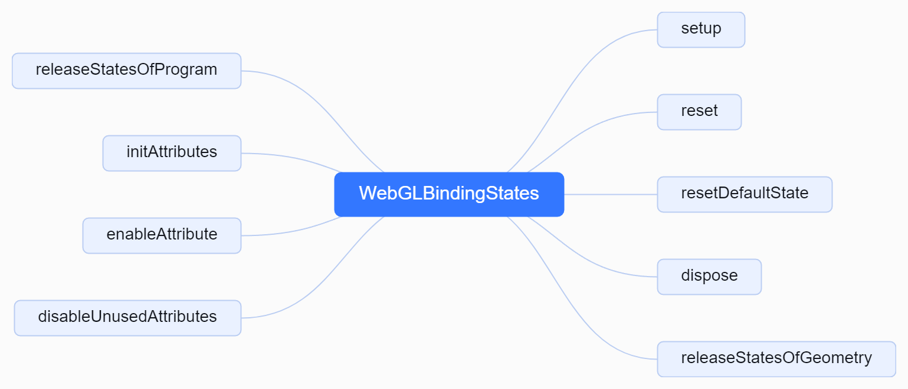

# 1. 初始化 WebGL 绑定状态
主要是将数据传递给着色器处理
```js
// 初始化 WebGL 绑定状态, 主要是执行以下代码的逻辑
/**
*  //缓冲区中的数据按照一定的规律传递给位置变量apos
    gl.vertexAttribPointer(aposLocation, 3, gl.FLOAT, false, 0, 0);
    //允许数据传递
    gl.enableVertexAttribArray(aposLocation);
*/
bindingStates = new WebGLBindingStates(_gl, attributes);
```
# 2. WebGLBindingStates结构图



# 3. WebGLBindingStates源码解读
## 3.1. 初始化渲染器状态
```js
/**
 * 设置渲染器状态
 *
 * @param object 渲染对象
 * @param material 材质
 * @param program 着色器程序
 * @param geometry 几何体
 * @param index 索引
 * @returns 无返回值
 */
function setup(object, material, program, geometry, index) {
    // 初始化updateBuffers为false
    let updateBuffers = false;
    // 获取当前绑定状态
    const state = getBindingState(geometry, program, material);
    // 如果当前状态不等于获取到的状态
    if (currentState !== state) {
        // 更新当前状态
        currentState = state;
        // 绑定顶点数组对象
        bindVertexArrayObject(currentState.object);
    }
    // 判断是否需要更新缓冲区
    updateBuffers = needsUpdate(object, geometry, program, index);
    // 如果需要更新缓冲区，则保存缓存
    if (updateBuffers) saveCache(object, geometry, program, index);
    // 如果index不为null
    if (index !== null) {
        // 更新属性索引
        attributes.update(index, gl.ELEMENT_ARRAY_BUFFER);
    }
    // 如果需要更新缓冲区或者强制更新
    if (updateBuffers || forceUpdate) {
        // 取消强制更新标记
        forceUpdate = false;
        // 设置顶点属性
        setupVertexAttributes(object, material, program, geometry);
        if (index !== null) {
            gl.bindBuffer(gl.ELEMENT_ARRAY_BUFFER, attributes.get(index).buffer);
        }
    }
}
```
## 3.2. 获取绑定状态
```js
/**
 * 获取绑定状态
 *
 * @param geometry 几何体
 * @param program 着色器程序
 * @param material 材质
 * @returns 绑定状态
 */
function getBindingState(geometry, program, material) {
	// 判断是否为线框模式
	const wireframe = (material.wireframe === true);
	// 获取根据 geometry 的 id 对应的 programMap
	let programMap = bindingStates[geometry.id];
	if (programMap === undefined) {
		// 若不存在，则创建一个新的 programMap
		programMap = {};
		// 将新创建的 programMap 存入 bindingStates 中，以 geometry 的 id 为键
		bindingStates[geometry.id] = programMap;
	}
	// 获取根据 program 的 id 对应的 stateMap
	let stateMap = programMap[program.id];
	if (stateMap === undefined) {
		// 若不存在，则创建一个新的 stateMap
		stateMap = {};
		// 将新创建的 stateMap 存入 programMap 中，以 program 的 id 为键
		programMap[program.id] = stateMap;
	}
	// 根据 wireframe 的值获取对应的 state
	let state = stateMap[wireframe];
	if (state === undefined) {
		// 若不存在，则创建一个新的 state
		state = createBindingState(createVertexArrayObject());
		// 将新创建的 state 存入 stateMap 中，以 wireframe 的值为键
		stateMap[wireframe] = state;
	}
	// 返回 state
	return state;
}
```
## 3.3. 创建绑定状态
```js
/**
 * 创建绑定状态
 *
 * @param vao 顶点数组对象
 * @returns 返回绑定状态对象，包含以下属性：
 * - geometry: 几何体对象（为了在不支持VAO的浏览器上的向后兼容性）
 * - program: 着色器程序对象
 * - wireframe: 是否为线框模式，默认为false
 * - newAttributes: 新属性数组
 * - enabledAttributes: 已启用属性数组
 * - attributeDivisors: 属性除数数组
 * - object: 顶点数组对象
 * - attributes: 属性对象
 * - index: 索引对象
 */
function createBindingState(vao) {
	// 初始化新的属性数组
	const newAttributes = [];
	// 初始化已启用的属性数组
	const enabledAttributes = [];
	// 初始化属性除数数组
	const attributeDivisors = [];
	// 遍历所有可能的顶点属性
	for (let i = 0; i < maxVertexAttributes; i++) {
		// 初始化新的属性值为0
		newAttributes[i] = 0;
		// 初始化已启用的属性值为0
		enabledAttributes[i] = 0;
		// 初始化属性除数值为0
		attributeDivisors[i] = 0;
	}
	return {
		// 兼容不支持VAO的浏览器的旧版本
		// 用于向后兼容不支持VAO的浏览器
		geometry: null,
		// 程序对象
		program: null,
		// 是否使用线框模式
		wireframe: false,
		// 新的属性数组
		newAttributes: newAttributes,
		// 已启用的属性数组
		enabledAttributes: enabledAttributes,
		// 属性除数数组
		attributeDivisors: attributeDivisors,
		// 顶点数组对象
		object: vao,
		// 属性对象
		attributes: {},
		// 索引对象
		index: null
	};
}
```
## 3.4. 顶点数组对象的创建绑定和删除
```js
// 返回 GPU 支持的最大顶点属性数量。
// 顶点属性是输入到顶点着色器的数据，可以包括位置、法线、纹理坐标、颜色等。
const maxVertexAttributes = gl.getParameter(gl.MAX_VERTEX_ATTRIBS);
const bindingStates = {};
const defaultState = createBindingState(null);
let currentState = defaultState;
let forceUpdate = false;
/**
 * 创建一个顶点数组对象
 *
 * @returns 返回创建的顶点数组对象
 */
function createVertexArrayObject() {
	// 是 WebGL 2.0 中用于创建一个新的顶点数组对象（VAO）的函数。顶点数组对象（VAO）用于存储顶点属性的配置，简化了在渲染时切换不同顶点属性配置的操作
	// 使用 VAO 的主要好处是可以将多个顶点属性的状态存储在一个对象中，当你需要渲染多个对象时，可以通过绑定不同的 VAO 来切换顶点属性配置，而不需要逐一设置每个属性
	return gl.createVertexArray();

}

/**
 * 绑定顶点数组对象
 *
 * @param vao 顶点数组对象
 * @returns 绑定结果
 */
function bindVertexArrayObject(vao) {
	// 绑定顶点数组对象
	return gl.bindVertexArray(vao);
}

/**
 * 删除顶点数组对象
 *
 * @param vao 顶点数组对象
 * @returns 顶点数组对象删除状态
 */
function deleteVertexArrayObject(vao) {
	return gl.deleteVertexArray(vao);
}

/**
 * 获取绑定状态
 *
 * @param geometry 几何体
 * @param program 着色器程序
 * @param material 材质
 * @returns 绑定状态
 */
function getBindingState(geometry, program, material) {
	// 判断是否为线框模式
	const wireframe = (material.wireframe === true);
	// 获取根据 geometry 的 id 对应的 programMap
	let programMap = bindingStates[geometry.id];
	if (programMap === undefined) {
		// 若不存在，则创建一个新的 programMap
		programMap = {};
		// 将新创建的 programMap 存入 bindingStates 中，以 geometry 的 id 为键
		bindingStates[geometry.id] = programMap;
	}
	// 获取根据 program 的 id 对应的 stateMap
	let stateMap = programMap[program.id];
	if (stateMap === undefined) {
		// 若不存在，则创建一个新的 stateMap
		stateMap = {};
		// 将新创建的 stateMap 存入 programMap 中，以 program 的 id 为键
		programMap[program.id] = stateMap;
	}
	// 根据 wireframe 的值获取对应的 state
	let state = stateMap[wireframe];
	if (state === undefined) {
		// 若不存在，则创建一个新的 state
		state = createBindingState(createVertexArrayObject());
		// 将新创建的 state 存入 stateMap 中，以 wireframe 的值为键
		stateMap[wireframe] = state;
	}
	// 返回 state
	return state;
}
```
## 3.5. 内存释放
```js
/**
 * 释放资源函数
 *
 * @description 释放WebGL资源，包括重置状态、删除顶点数组对象等
 * @returns 无返回值
 */
function dispose() {
	// 重置函数
	reset();
	// 遍历 bindingStates 对象
	for (const geometryId in bindingStates) {
		// 获取当前 geometryId 对应的 programMap 对象
		const programMap = bindingStates[geometryId];
		// 遍历 programMap 对象
		for (const programId in programMap) {
			// 获取当前 programId 对应的 stateMap 对象
			const stateMap = programMap[programId];
			// 遍历 stateMap 对象
			for (const wireframe in stateMap) {
				// 删除 stateMap[wireframe].object 对应的顶点数组对象
				deleteVertexArrayObject(stateMap[wireframe].object);
				// 删除 stateMap[wireframe] 属性
				delete stateMap[wireframe];
			}
			// 删除 programMap[programId] 属性
			delete programMap[programId];
		}
		// 删除 bindingStates[geometryId] 属性
		delete bindingStates[geometryId];
	}
}

/**
 * 释放几何体的状态
 *
 * @param geometry 几何体对象
 * @returns 无返回值
 */
function releaseStatesOfGeometry(geometry) {
	// 如果当前几何体的绑定状态不存在，则直接返回
	if (bindingStates[geometry.id] === undefined) return;
	// 获取当前几何体的程序映射
	const programMap = bindingStates[geometry.id];
	// 遍历程序映射中的每个程序ID
	for (const programId in programMap) {
		// 获取当前程序ID的状态映射
		const stateMap = programMap[programId];
		// 遍历状态映射中的每个线框状态
		for (const wireframe in stateMap) {
			// 删除顶点数组对象
			deleteVertexArrayObject(stateMap[wireframe].object);
			// 删除线框状态
			delete stateMap[wireframe];
		}
		// 删除程序ID的状态映射
		delete programMap[programId];
	}
	// 删除几何体的绑定状态
	delete bindingStates[geometry.id];
}

/**
 * 释放程序的绑定状态
 *
 * @param program 程序对象
 * @returns 无返回值
 */
function releaseStatesOfProgram(program) {
	// 遍历 bindingStates 对象
	for (const geometryId in bindingStates) {
		// 获取当前 geometryId 对应的 programMap
		const programMap = bindingStates[geometryId];
		// 如果 programMap 中不存在当前 program 的 id，则跳过当前循环
		if (programMap[program.id] === undefined) continue;
		// 获取当前 program 的 stateMap
		const stateMap = programMap[program.id];
		// 遍历 stateMap 对象
		for (const wireframe in stateMap) {
			// 删除当前 wireframe 对应的顶点数组对象
			deleteVertexArrayObject(stateMap[wireframe].object);
			// 删除当前 wireframe
			delete stateMap[wireframe];
		}
		// 删除当前 program 的信息
		delete programMap[program.id];
	}
}

/**
 * 重置函数
 *
 * @returns 无返回值
 */
function reset() {
	// 重置默认状态
	resetDefaultState();
	// 强制更新标志设为 true
	forceUpdate = true;
	// 如果当前状态等于默认状态，则直接返回
	if (currentState === defaultState) return;
	// 将当前状态设为默认状态
	currentState = defaultState;
	// 绑定顶点数组对象到当前状态的物体上
	bindVertexArrayObject(currentState.object);
}
/**
 * 重置默认状态
 *
 * @returns 无返回值
 */
function resetDefaultState() {
	defaultState.geometry = null;
	defaultState.program = null;
	defaultState.wireframe = false;
}
```
## 3.6. 启用并设置顶点参数
```js
/**
 * 启用属性及除数
 *
 * @param attribute 属性
 * @param meshPerAttribute 每个网格的属性数量
 */
function enableAttributeAndDivisor(attribute, meshPerAttribute) {
	// 获取当前状态中的属性
	const newAttributes = currentState.newAttributes;
	// 获取当前状态中的已启用属性
	const enabledAttributes = currentState.enabledAttributes;
	// 获取当前状态中的属性除数
	const attributeDivisors = currentState.attributeDivisors;
	// 将新属性设为1
	newAttributes[attribute] = 1;
	// 如果当前属性未被启用
	if (enabledAttributes[attribute] === 0) {
		// 启用当前属性对应的顶点属性数组
		gl.enableVertexAttribArray(attribute);
		// 将当前属性标记为已启用
		enabledAttributes[attribute] = 1;
	}
	// 如果当前属性的除数不等于传入的meshPerAttribute
	if (attributeDivisors[attribute] !== meshPerAttribute) {
		// 设置当前属性的除数为传入的meshPerAttribute
		gl.vertexAttribDivisor(attribute, meshPerAttribute);
		// 更新当前属性的除数
		attributeDivisors[attribute] = meshPerAttribute;
	}
}

/**
 * 设置顶点属性数组的参数
 *
 * @param index 顶点属性数组的索引
 * @param size 顶点属性数组中每个元素包含的组件数量
 * @param type 顶点属性数组中元素的数据类型
 * @param normalized 是否将顶点属性数组中的非浮点数值归一化
 * @param stride 顶点属性数组中每个顶点所有属性占用的总字节数
 * @param offset 顶点属性数组中第一个顶点的偏移量
 * @param integer 是否使用 gl.vertexAttribIPointer 替代 gl.vertexAttribPointer
 */
function vertexAttribPointer(index, size, type, normalized, stride, offset, integer) {
	if (integer === true) {
		gl.vertexAttribIPointer(index, size, type, stride, offset);
	} else {
		// gl.vertexAttribPointer(aposLocation,2,gl.FLOAT,false,0,0);
		gl.vertexAttribPointer(index, size, type, normalized, stride, offset);
	}
}
```
## 3.7. 判断是否需要更新渲染状态
```js
/**
 * 判断是否需要更新 WebGL 渲染状态
 *
 * @param object 渲染的物体对象
 * @param geometry 渲染的几何体对象
 * @param program 渲染的着色器程序
 * @param index 当前索引
 * @returns 是否需要更新 WebGL 渲染状态，返回布尔值
 */
function needsUpdate(object, geometry, program, index) {
	// 获取当前状态的属性
	const cachedAttributes = currentState.attributes;
	// 获取几何体的属性
	const geometryAttributes = geometry.attributes;
	let attributesNum = 0;
	// 获取程序对象的属性
	const programAttributes = program.getAttributes();
	for (const name in programAttributes) {
		// 获取程序对象的某个属性
		const programAttribute = programAttributes[name];
		// 判断程序对象属性的位置是否有效
		if (programAttribute.location >= 0) {
			// 获取缓存中的属性
			const cachedAttribute = cachedAttributes[name];
			// 获取几何体的某个属性
			let geometryAttribute = geometryAttributes[name];
			// 如果几何体属性不存在
			if (geometryAttribute === undefined) {
				// 如果属性名为'instanceMatrix'且对象有instanceMatrix属性，则将instanceMatrix赋值给几何体属性
				if (name === 'instanceMatrix' && object.instanceMatrix) geometryAttribute = object.instanceMatrix;
				// 如果属性名为'instanceColor'且对象有instanceColor属性，则将instanceColor赋值给几何体属性
				if (name === 'instanceColor' && object.instanceColor) geometryAttribute = object.instanceColor;
			}
			// 如果缓存中的属性不存在，则返回true
			if (cachedAttribute === undefined) return true;
			// 如果缓存中的属性与几何体属性不一致，则返回true
			if (cachedAttribute.attribute !== geometryAttribute) return true;
			// 如果几何体属性存在且缓存中的属性数据与几何体属性数据不一致，则返回true
			if (geometryAttribute && cachedAttribute.data !== geometryAttribute.data) return true;
			// 累加有效的属性数量
			attributesNum++;
		}
	}
	// 如果当前状态的属性数量与有效的属性数量不一致，则返回true
	if (currentState.attributesNum !== attributesNum) return true;
	// 如果当前状态的索引与传入的索引不一致，则返回true
	if (currentState.index !== index) return true;
	// 否则返回false
	return false;
}
```
## 3.8. 保存属性数据
```js
/**
 * 保存缓存
 *
 * @param object 对象
 * @param geometry 几何体
 * @param program 程序
 * @param index 索引
 */
function saveCache(object, geometry, program, index) {
	// 创建一个空对象作为缓存
	const cache = {};
	// 获取geometry的属性
	const attributes = geometry.attributes;
	// 初始化属性数量
	let attributesNum = 0;
	// 获取program的属性
	const programAttributes = program.getAttributes();
	// 遍历program的属性
	for (const name in programAttributes) {
		// 获取当前属性的信息
		const programAttribute = programAttributes[name];
		// 如果当前属性有位置信息
		if (programAttribute.location >= 0) {
			// 获取geometry的对应属性
			let attribute = attributes[name];
			// 如果找不到对应的属性
			if (attribute === undefined) {
				// 如果属性名为'instanceMatrix'并且object有instanceMatrix属性，则将object的instanceMatrix赋值给attribute
				if (name === 'instanceMatrix' && object.instanceMatrix) attribute = object.instanceMatrix;
				// 如果属性名为'instanceColor'并且object有instanceColor属性，则将object的instanceColor赋值给attribute
				if (name === 'instanceColor' && object.instanceColor) attribute = object.instanceColor;
			}
			// 创建一个空对象用于存储属性信息
			const data = {};
			// 将attribute赋值给data的attribute属性
			data.attribute = attribute;
			// 如果attribute存在且拥有data属性
			if (attribute && attribute.data) {
				// 将attribute的data属性赋值给data的data属性
				data.data = attribute.data;
			}
			// 将data存储到cache中，以name为键
			cache[name] = data;
			// 属性数量加1
			attributesNum++;
		}
	}
	// 将缓存存储到currentState的attributes属性中
	currentState.attributes = cache;
	// 将属性数量存储到currentState的attributesNum属性中
	currentState.attributesNum = attributesNum;
	// 将index存储到currentState的index属性中
	currentState.index = index;
}
```