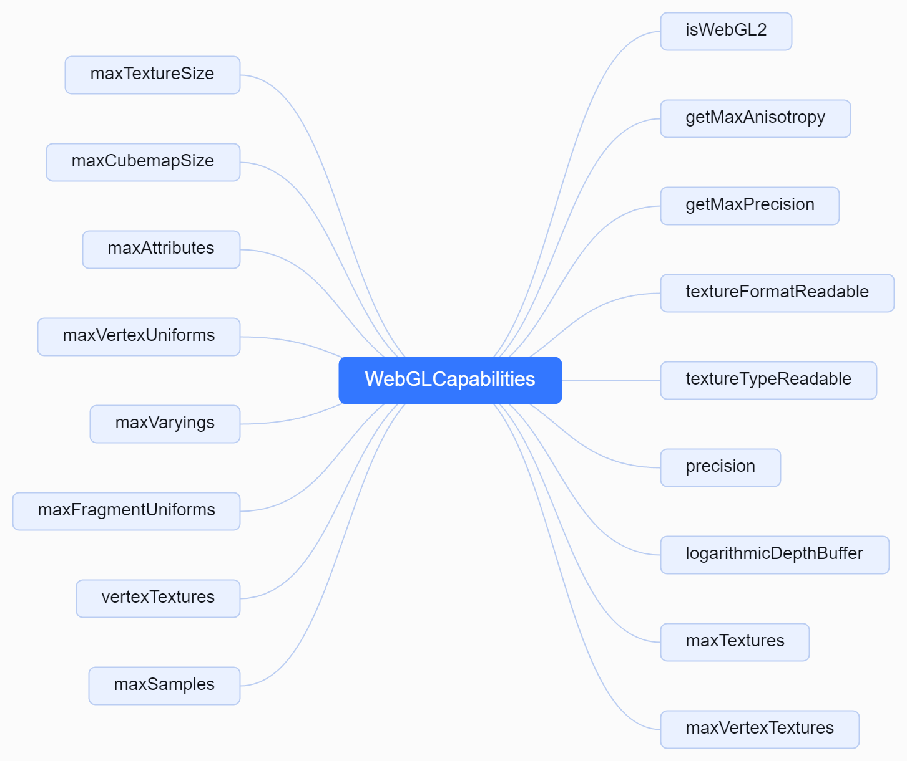

# 1. 初始化 WebGL  上下文的相关能力
```js
// 构造函数的参数
const {
    canvas = createCanvasElement(),
    context = null, // 即gl	context = canvas.getContext( 'webgl', { alpha: false } ),
    depth = true, //绘图缓存是否有一个至少6位的深度缓存(depth buffer )
    stencil = false,//绘图缓存是否有一个至少8位的模板缓存
    alpha = false,// controls the default clear alpha value. When set to true, the value is 0. Otherwise it's 1. Default is false
    antialias = false,//是否执行抗锯齿
    premultipliedAlpha = true,// renderer是否假设颜色有 premultiplied alpha
    preserveDrawingBuffer = false,//是否保留缓直到手动清除或被覆盖
    powerPreference = 'default',// 提示用户代理怎样的配置更适用于当前WebGL环境
    failIfMajorPerformanceCaveat = false,//检测渲染器是否会因性能过差而创建失败
} = parameters;
// 初始化 WebGL 扩展
extensions = new WebGLExtensions(_gl);
// 初始化 WebGL 实用工具
utils = new WebGLUtils(_gl, extensions);
// 初始化 WebGL 功能
capabilities = new WebGLCapabilities(_gl, extensions, parameters, utils);
```
## 1.1 源码结构



## 1.2 源码解读
```js
import { FloatType, HalfFloatType, RGBAFormat, UnsignedByteType } from '../../constants.js';
/**
 * WebGLCapabilities 构造函数，用于获取 WebGL 上下文的相关能力信息。
 *
 * @param {WebGLRenderingContext} gl - WebGL 渲染上下文。
 * @param {Map<string, any>} extensions - 支持的 WebGL 扩展。
 * @param {object} parameters - 初始化参数。
 * @param {object} utils - 工具函数集合。
 * @returns {object} - 包含了 WebGL 上下文能力的对象。
 */
function WebGLCapabilities( gl, extensions, parameters, utils ) {
	let maxAnisotropy;
	/**
	 * 获取最大各向异性过滤值
	 *
	 * @returns 返回最大各向异性过滤值，如果不支持则返回0
	 */
	function getMaxAnisotropy() {
		if ( maxAnisotropy !== undefined ) return maxAnisotropy;
		if ( extensions.has( 'EXT_texture_filter_anisotropic' ) === true ) {
			const extension = extensions.get( 'EXT_texture_filter_anisotropic' );
			maxAnisotropy = gl.getParameter( extension.MAX_TEXTURE_MAX_ANISOTROPY_EXT );
		} else {
			maxAnisotropy = 0;
		}
		return maxAnisotropy;
	}
	/**
	 * 判断纹理格式是否可读
	 *
	 * @param textureFormat 纹理格式
	 * @returns 返回布尔值，表示纹理格式是否可读
	 */
	function textureFormatReadable( textureFormat ) {
		if ( textureFormat !== RGBAFormat && utils.convert( textureFormat ) !== gl.getParameter( gl.IMPLEMENTATION_COLOR_READ_FORMAT ) ) {
			return false;
		}
		return true;
	}
	/**
	 * 判断纹理类型是否可读
	 *
	 * @param textureType 纹理类型
	 * @returns 如果纹理类型可读，则返回true；否则返回false
	 */
	function textureTypeReadable( textureType ) {
		const halfFloatSupportedByExt = ( textureType === HalfFloatType ) && ( extensions.has( 'EXT_color_buffer_half_float' ) || extensions.has( 'EXT_color_buffer_float' ) );
		if ( textureType !== UnsignedByteType && utils.convert( textureType ) !== gl.getParameter( gl.IMPLEMENTATION_COLOR_READ_TYPE ) && // Edge and Chrome Mac < 52 (#9513)
			textureType !== FloatType && ! halfFloatSupportedByExt ) {
			return false;
		}
		return true;
	}
	/**
	 * 获取最大精度
	 *
	 * @param precision 精度类型，可选值为 'highp'、'mediump'、'lowp'
	 * @returns 返回最大精度类型，可选值为 'highp'、'mediump'、'lowp'
	 */
	function getMaxPrecision( precision ) {
		if ( precision === 'highp' ) {
			if ( gl.getShaderPrecisionFormat( gl.VERTEX_SHADER, gl.HIGH_FLOAT ).precision > 0 &&
				gl.getShaderPrecisionFormat( gl.FRAGMENT_SHADER, gl.HIGH_FLOAT ).precision > 0 ) {
				return 'highp';
			}
			precision = 'mediump';
		}
		if ( precision === 'mediump' ) {
			if ( gl.getShaderPrecisionFormat( gl.VERTEX_SHADER, gl.MEDIUM_FLOAT ).precision > 0 &&
				gl.getShaderPrecisionFormat( gl.FRAGMENT_SHADER, gl.MEDIUM_FLOAT ).precision > 0 ) {
				return 'mediump';
			}
		}
		return 'lowp';
	}
	let precision = parameters.precision !== undefined ? parameters.precision : 'highp';
	const maxPrecision = getMaxPrecision( precision );
	if ( maxPrecision !== precision ) {
		console.warn( 'THREE.WebGLRenderer:', precision, 'not supported, using', maxPrecision, 'instead.' );
		precision = maxPrecision;
	}
	const logarithmicDepthBuffer = parameters.logarithmicDepthBuffer === true;
	//  查询片段着色器中可以同时访问的最大纹理单元数量
	const maxTextures = gl.getParameter( gl.MAX_TEXTURE_IMAGE_UNITS );
	// 查询顶点着色器中可以同时访问的最大纹理单元数量
	const maxVertexTextures = gl.getParameter( gl.MAX_VERTEX_TEXTURE_IMAGE_UNITS );
	// 查询 WebGL 支持的最大二维纹理的宽度和高度。这个值通常是 2 的幂，例如 2048 或 4096，它定义了可以创建的最大纹理的尺寸。
	const maxTextureSize = gl.getParameter( gl.MAX_TEXTURE_SIZE );
	// 查询 WebGL 支持的最大立方体贴图纹理的尺寸
	const maxCubemapSize = gl.getParameter( gl.MAX_CUBE_MAP_TEXTURE_SIZE );
	//  查询 WebGL 顶点着色器可以使用的最大顶点属性数量
	const maxAttributes = gl.getParameter( gl.MAX_VERTEX_ATTRIBS );
	//  查询顶点着色器中可以使用的最大 uniform 变量的数量
	const maxVertexUniforms = gl.getParameter( gl.MAX_VERTEX_UNIFORM_VECTORS );
	// 查询顶点着色器和片段着色器之间可以传递的最大 varying 变量数量
	const maxVaryings = gl.getParameter( gl.MAX_VARYING_VECTORS );
	// 查询片段着色器中可以使用的最大 uniform 变量的数量
	const maxFragmentUniforms = gl.getParameter( gl.MAX_FRAGMENT_UNIFORM_VECTORS );
	const vertexTextures = maxVertexTextures > 0;
	// 用于查询 WebGL 渲染上下文中多重采样（Multisample Anti-Aliasing, MSAA）的最大样本数量
	const maxSamples = gl.getParameter( gl.MAX_SAMPLES );
	return {
		isWebGL2: true, // keeping this for backwards compatibility
		getMaxAnisotropy: getMaxAnisotropy,
		getMaxPrecision: getMaxPrecision,
		textureFormatReadable: textureFormatReadable,
		textureTypeReadable: textureTypeReadable,
		precision: precision,
		logarithmicDepthBuffer: logarithmicDepthBuffer,
		maxTextures: maxTextures,
		maxVertexTextures: maxVertexTextures,
		maxTextureSize: maxTextureSize,
		maxCubemapSize: maxCubemapSize,
		maxAttributes: maxAttributes,
		maxVertexUniforms: maxVertexUniforms,
		maxVaryings: maxVaryings,
		maxFragmentUniforms: maxFragmentUniforms,
		vertexTextures: vertexTextures,
		maxSamples: maxSamples
	};
}
export { WebGLCapabilities };
```