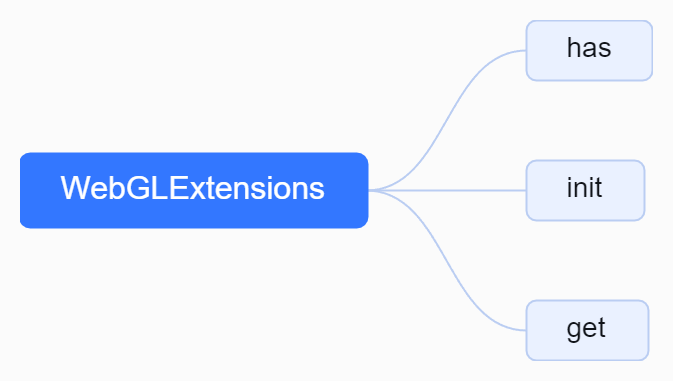

# 1. 初始化 WebGL 扩展
```js
// 初始化 WebGL 扩展
extensions = new WebGLExtensions(_gl);
extensions.init();
```
## 1.1 源码结构


## 1.2. 源码分析解读
```js
import { warnOnce } from '../../utils.js';
/**
 * WebGL扩展类，用于获取WebGL的扩展功能
 *
 * @param {WebGLRenderingContext} gl - WebGL渲染上下文
 * @returns {Object} 包含扩展功能的方法的对象
 */
function WebGLExtensions( gl ) {
	const extensions = {};
	/**
	 * 获取 WebGL 扩展
	 *
	 * @param name 扩展名称
	 * @returns 返回 WebGL 扩展对象，若不存在则返回 null
	 */
	function getExtension( name ) {
		// 如果扩展名已经在扩展名映射表中存在，则直接返回对应的扩展对象
		if ( extensions[ name ] !== undefined ) {
			return extensions[ name ];
		}
		let extension;
		switch ( name ) {
			case 'WEBGL_depth_texture':
				// 尝试获取名为 'WEBGL_depth_texture' 的扩展对象，如果不存在则尝试获取 'MOZ_WEBGL_depth_texture'，如果还不存在则尝试获取 'WEBKIT_WEBGL_depth_texture'
				extension = gl.getExtension( 'WEBGL_depth_texture' ) || gl.getExtension( 'MOZ_WEBGL_depth_texture' ) || gl.getExtension( 'WEBKIT_WEBGL_depth_texture' );
				break;
			case 'EXT_texture_filter_anisotropic':
				// 尝试获取名为 'EXT_texture_filter_anisotropic' 的扩展对象，如果不存在则尝试获取 'MOZ_EXT_texture_filter_anisotropic'，如果还不存在则尝试获取 'WEBKIT_EXT_texture_filter_anisotropic'
				extension = gl.getExtension( 'EXT_texture_filter_anisotropic' ) || gl.getExtension( 'MOZ_EXT_texture_filter_anisotropic' ) || gl.getExtension( 'WEBKIT_EXT_texture_filter_anisotropic' );
				break;
			case 'WEBGL_compressed_texture_s3tc':
				// 尝试获取名为 'WEBGL_compressed_texture_s3tc' 的扩展对象，如果不存在则尝试获取 'MOZ_WEBGL_compressed_texture_s3tc'，如果还不存在则尝试获取 'WEBKIT_WEBGL_compressed_texture_s3tc'
				extension = gl.getExtension( 'WEBGL_compressed_texture_s3tc' ) || gl.getExtension( 'MOZ_WEBGL_compressed_texture_s3tc' ) || gl.getExtension( 'WEBKIT_WEBGL_compressed_texture_s3tc' );
				break;
			case 'WEBGL_compressed_texture_pvrtc':
				// 尝试获取名为 'WEBGL_compressed_texture_pvrtc' 的扩展对象，如果不存在则尝试获取 'WEBKIT_WEBGL_compressed_texture_pvrtc'
				extension = gl.getExtension( 'WEBGL_compressed_texture_pvrtc' ) || gl.getExtension( 'WEBKIT_WEBGL_compressed_texture_pvrtc' );
				break;
			default:
				// 尝试获取指定名称的扩展对象
				extension = gl.getExtension( name );
		}
		// 将获取到的扩展对象保存到扩展名映射表中
		extensions[ name ] = extension;
		// 返回获取到的扩展对象
		return extension;
	}
	return {
		has: function ( name ) {
			return getExtension( name ) !== null;
		},
		init: function () {
			// 初始化扩展
			getExtension( 'EXT_color_buffer_float' );
			getExtension( 'WEBGL_clip_cull_distance' );
			getExtension( 'OES_texture_float_linear' );
			getExtension( 'EXT_color_buffer_half_float' );
			getExtension( 'WEBGL_multisampled_render_to_texture' );
			getExtension( 'WEBGL_render_shared_exponent' );
		},
		get: function ( name ) {
			const extension = getExtension( name );
			if ( extension === null ) {
				warnOnce( 'THREE.WebGLRenderer: ' + name + ' extension not supported.' );
			}
			return extension;
		}
	};
}
export { WebGLExtensions };
```js