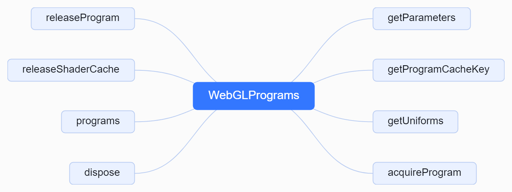

# 1. 初始化 WebGL 程序缓存
```js
// 初始化 WebGL 程序缓存  可以看成是如下代码
/**
    *  function createShader(gl, type, source) {
    	const shader = gl.createShader(type);
    	gl.shaderSource(shader, source);
    	gl.compileShader(shader);
    	const success = gl.getShaderParameter(shader, gl.COMPILE_STATUS);
    	if (success) {
    		return shader;
    	}
    	console.log(gl.getShaderInfoLog(shader));
    	gl.deleteShader(shader);
    }
    function createProgram(gl, vertexShader, fragmentShader) {
    	const program = gl.createProgram();
    	gl.attachShader(program, vertexShader);
    	gl.attachShader(program, fragmentShader);
    	gl.linkProgram(program);
    	const success = gl.getProgramParameter(program, gl.LINK_STATUS);
    	if (success) {
    		return program;
    	}
    	console.log(gl.getProgramInfoLog(program));
    	gl.deleteProgram(program);
    }
*/
programCache = new WebGLPrograms(_this, cubemaps, cubeuvmaps, extensions, capabilities, bindingStates, clipping);
```
# 2. WebGLPrograms结构图



# 3. WebGLPrograms源码解析
## 3.1. 获取program对象
```js
/**
 * 获取程序对象
 *
 * @param parameters 参数对象
 * @param cacheKey 缓存键
 * @returns 返回程序对象
 */
function acquireProgram( parameters, cacheKey ) {
	let program;
	// 检查是否已经编译过代码
	// Check if code has been already compiled
	for ( let p = 0, pl = programs.length; p < pl; p ++ ) {
		const preexistingProgram = programs[ p ];
		// 如果已存在的程序的缓存键与传入的缓存键相同
		if ( preexistingProgram.cacheKey === cacheKey ) {
			// 将已存在的程序赋值给 program
			program = preexistingProgram;
			// 增加已存在程序的使用次数
			++ program.usedTimes;
			// 跳出循环
			break;
		}
	}
	// 如果 program 仍然为 undefined，说明没有已存在的程序
	if ( program === undefined ) {
		// 创建一个新的 WebGLProgram 对象，并将其赋值给 program
		program = new WebGLProgram( renderer, cacheKey, parameters, bindingStates );
		// 将新创建的 program 添加到 programs 数组中
		programs.push( program );
	}
	// 返回 program
	return program;
}
```
## 3.2. 获取uniforms数据
```js
/**
 * 获取材质的统一变量
 *
 * @param material 材质对象
 * @returns 返回统一变量对象
 */
function getUniforms( material ) {
	// 根据材质类型获取着色器ID
	const shaderID = shaderIDs[ material.type ];
	let uniforms;
	// 如果着色器ID存在
	if ( shaderID ) {
		// 根据着色器ID获取着色器对象
		const shader = ShaderLib[ shaderID ];
		// 克隆着色器的uniforms对象
		uniforms = UniformsUtils.clone( shader.uniforms );
	// 如果着色器ID不存在
	} else {
		// 直接使用材质的uniforms对象
		uniforms = material.uniforms;
	}
	// 返回uniforms对象
	return uniforms;
}
```
## 3.3. 内存释放
```js
/**
 * 释放程序资源
 *
 * @param program 要释放的程序资源
 * @returns 无返回值
 */
function releaseProgram( program ) {
	if ( -- program.usedTimes === 0 ) {
		// Remove from unordered set
		const i = programs.indexOf( program );
		// 删除第i个，将最后位置的移到i位置
		programs[ i ] = programs[ programs.length - 1 ];
		programs.pop();
		// Free WebGL resources
		program.destroy();
	}
}

/**
 * 释放着色器缓存
 *
 * @param material 要释放缓存的材质对象
 */
function releaseShaderCache( material ) {
	_customShaders.remove( material );
}

function dispose() {
	_customShaders.dispose();
}
```