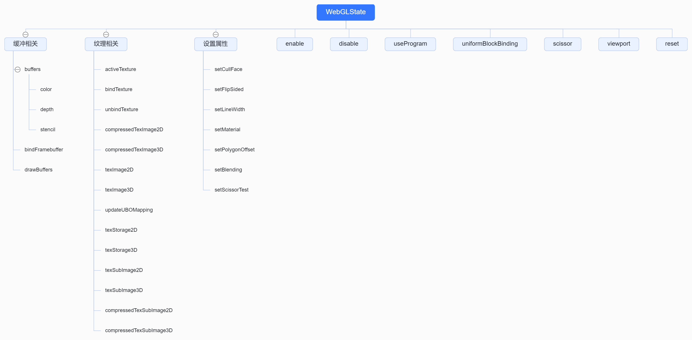

# 1. 初始化 WebGL 状态 
```js
// 初始化 WebGL 状态 颜色、深度、混合等缓冲区 纹理等
state = new WebGLState(_gl);
```
## 1.1. WebGLState结构



## 1.2. WebGLState源码解析
* 缓冲区(颜色、深度、模板)结构图


* 缓冲区源码解读
```js
/**
 * ColorBuffer类用于管理WebGL中的颜色缓冲区设置，包括颜色掩码、清除颜色以及锁定状态。
 * @returns {Object} 返回一个包含颜色缓冲区操作方法的对象。
 */
function ColorBuffer() {
    let locked = false; // 锁定状态，防止在渲染过程中修改颜色缓冲区设置
    const color = new Vector4(); // 用于存储当前设置的颜色值
    let currentColorMask = null; // 当前设置的颜色掩码
    const currentColorClear = new Vector4(0, 0, 0, 0); // 当前设置的清除颜色
    return {
        /**
         * 设置颜色掩码。
         * @param {boolean} colorMask - 一个布尔值，用于控制RGBA四个通道是否写入颜色缓冲区。
         */
        setMask: function(colorMask) {
            if (currentColorMask !== colorMask && !locked) {
                gl.colorMask( colorMask, colorMask, colorMask, colorMask );
                currentColorMask = colorMask;
            }
        },
        setLocked: function ( lock ) {
            locked = lock;
        },
        // 设置颜色缓冲区清除值
        setClear: function ( r, g, b, a, premultipliedAlpha ) {
            if ( premultipliedAlpha === true ) {
                r *= a; g *= a; b *= a;
            }
            color.set( r, g, b, a );
            if ( currentColorClear.equals( color ) === false ) {
                gl.clearColor( r, g, b, a );
                currentColorClear.copy( color );
            }
        },
        // 重置数据
        reset: function () {
            locked = false;
            currentColorMask = null;
            currentColorClear.set( - 1, 0, 0, 0 ); // set to invalid state
        }
    };
}

/**
 * 深度缓冲区管理类
 * 用于管理和配置WebGL的深度测试、深度掩码、深度函数和深度清除值。
 * @returns {Object} 返回一个包含深度缓冲区管理方法的对象
 */
function DepthBuffer() {
    // 定义一个标志，用于控制深度缓冲区设置是否锁定
    let locked = false;
    // 用于存储当前的深度测试掩码
    let currentDepthMask = null;
    // 用于存储当前的深度比较函数
    let currentDepthFunc = null;
    // 用于存储当前的深度清除值
    let currentDepthClear = null;
    return {
        // 设置是否启用深度测试
        setTest: function ( depthTest ) {
            if ( depthTest ) {
                // 如果启用深度测试
                enable( gl.DEPTH_TEST );
            } else {
                // 如果禁用深度测试
                disable( gl.DEPTH_TEST );
            }
        },
        // 设置深度缓冲区掩码
        setMask: function ( depthMask ) {
            // 如果当前掩码与传入的不同且深度缓冲区未锁定，则更新掩码
            if ( currentDepthMask !== depthMask && ! locked ) {
                // 设置深度缓冲区的写入启用标志
                gl.depthMask( depthMask ); // 设置 WebGL 深度缓冲区掩码
                currentDepthMask = depthMask; // 更新当前掩码
            }
        },
        // 设置深度比较函数
        // 用于比较每个传入像素深度值与深度缓冲区中深度值的函数
        setFunc: function ( depthFunc ) {
            // 如果当前比较函数与传入的不同，则根据传入的比较函数更新 WebGL 的深度比较设置
            if ( currentDepthFunc !== depthFunc ) {
                switch ( depthFunc ) {
                    case NeverDepth: // 假设 NeverDepth 是某种预定义的表示“从不”的比较方式
                        gl.depthFunc( gl.NEVER );
                        break;
                    case AlwaysDepth: // 假设 AlwaysDepth 是某种预定义的表示“总是”的比较方式
                        gl.depthFunc( gl.ALWAYS );
                        break;
                    // 其他比较方式类似，这里省略了具体的枚举值比较和设置
                    default:
                        gl.depthFunc( gl.LEQUAL ); // 默认使用“小于等于”的比较方式
                }
                currentDepthFunc = depthFunc; // 更新当前比较函数
            }
        },
        // 设置深度缓冲区是否锁定
        setLocked: function ( lock ) {
            locked = lock; // 更新锁定状态
        },
        // 设置深度清除值
        setClear: function ( depth ) {
            // 如果当前清除值与传入的不同，则更新 WebGL 的深度清除值
            if ( currentDepthClear !== depth ) {
                gl.clearDepth( depth ); // 设置 WebGL 深度清除值
                currentDepthClear = depth; // 更新当前清除值
            }
        },
        // 重置深度缓冲区设置
        reset: function () {
            locked = false; // 取消锁定
            currentDepthMask = null; // 重置掩码
            currentDepthFunc = null; // 重置比较函数
            currentDepthClear = null; // 重置清除值
        }
    };
}
/**
 * StencilBuffer 类，用于管理 WebGL 中的模板缓冲区设置
 */
function StencilBuffer() {
    let locked = false;
    let currentStencilMask = null;
    let currentStencilFunc = null;
    let currentStencilRef = null;
    let currentStencilFuncMask = null;
    let currentStencilFail = null;
    let currentStencilZFail = null;
    let currentStencilZPass = null;
    let currentStencilClear = null;
    return {
        // 设置模板缓冲区是否启用
        setTest: function ( stencilTest ) {
            if ( ! locked ) {
                if ( stencilTest ) {
                    enable( gl.STENCIL_TEST );
                } else {
                    disable( gl.STENCIL_TEST );
                }
            }
        },
        setMask: function ( stencilMask ) {
            if ( currentStencilMask !== stencilMask && ! locked ) {
                gl.stencilMask( stencilMask );
                currentStencilMask = stencilMask;
            }
        },
        // 设置模板测试的函数
        // 设置模板测试函数、引用值和掩码
        setFunc: function ( stencilFunc, stencilRef, stencilMask ) {
            if ( currentStencilFunc !== stencilFunc ||
                    currentStencilRef !== stencilRef ||
                    currentStencilFuncMask !== stencilMask ) {
                gl.stencilFunc( stencilFunc, stencilRef, stencilMask );
                currentStencilFunc = stencilFunc;
                currentStencilRef = stencilRef;
                currentStencilFuncMask = stencilMask;
            }
        },
        //  配置模板测试失败、深度测试失败和深度测试通过时的操作
        setOp: function ( stencilFail, stencilZFail, stencilZPass ) {
            if ( currentStencilFail !== stencilFail ||
                    currentStencilZFail !== stencilZFail ||
                    currentStencilZPass !== stencilZPass ) {
                gl.stencilOp( stencilFail, stencilZFail, stencilZPass );
                currentStencilFail = stencilFail;
                currentStencilZFail = stencilZFail;
                currentStencilZPass = stencilZPass;
            }
        },
        setLocked: function ( lock ) {
            locked = lock;
        },
        setClear: function ( stencil ) {
            if ( currentStencilClear !== stencil ) {
                gl.clearStencil( stencil );
                currentStencilClear = stencil;
            }
        },
        reset: function () {
            locked = false;
            currentStencilMask = null;
            currentStencilFunc = null;
            currentStencilRef = null;
            currentStencilFuncMask = null;
            currentStencilFail = null;
            currentStencilZFail = null;
            currentStencilZPass = null;
            currentStencilClear = null;
        }
    };
}
```
* 纹理源码解读
```js
/**
 * 创建一个纹理
 *
 * @param type 纹理类型
 * @param target 目标纹理类型
 * @param count 纹理数量
 * @param dimensions 纹理维度
 * @returns 返回创建的纹理
 */
function createTexture( type, target, count, dimensions ) {
    const data = new Uint8Array( 4 ); // 4 is required to match default unpack alignment of 4.
    const texture = gl.createTexture();
    gl.bindTexture( type, texture );
    gl.texParameteri( type, gl.TEXTURE_MIN_FILTER, gl.NEAREST );
    gl.texParameteri( type, gl.TEXTURE_MAG_FILTER, gl.NEAREST );
    for ( let i = 0; i < count; i ++ ) {
        if ( type === gl.TEXTURE_3D || type === gl.TEXTURE_2D_ARRAY ) {
            gl.texImage3D( target, 0, gl.RGBA, 1, 1, dimensions, 0, gl.RGBA, gl.UNSIGNED_BYTE, data );
        } else {
            gl.texImage2D( target + i, 0, gl.RGBA, 1, 1, 0, gl.RGBA, gl.UNSIGNED_BYTE, data );
        }
    }
    return texture;
}
/**
 * 激活纹理
 *
 * @param webglSlot WebGL纹理槽位，可选参数，默认为gl.TEXTURE0 + maxTextures - 1
 * @returns 无返回值
 */
function activeTexture( webglSlot ) {
    if ( webglSlot === undefined ) webglSlot = gl.TEXTURE0 + maxTextures - 1;
    if ( currentTextureSlot !== webglSlot ) {
        gl.activeTexture( webglSlot );
        currentTextureSlot = webglSlot;
    }
}
/**
 * 绑定纹理
 *
 * @param webglType WebGL纹理类型
 * @param webglTexture WebGL纹理对象
 * @param webglSlot WebGL纹理槽位，若未指定则使用当前纹理槽位
 */
function bindTexture( webglType, webglTexture, webglSlot ) {
    if ( webglSlot === undefined ) {
        if ( currentTextureSlot === null ) {
            webglSlot = gl.TEXTURE0 + maxTextures - 1;
        } else {
            webglSlot = currentTextureSlot;
        }
    }
    let boundTexture = currentBoundTextures[ webglSlot ];
    if ( boundTexture === undefined ) {
        boundTexture = { type: undefined, texture: undefined };
        currentBoundTextures[ webglSlot ] = boundTexture;
    }
    if ( boundTexture.type !== webglType || boundTexture.texture !== webglTexture ) {
        if ( currentTextureSlot !== webglSlot ) {
            gl.activeTexture( webglSlot );
            currentTextureSlot = webglSlot;
        }
        gl.bindTexture( webglType, webglTexture || emptyTextures[ webglType ] );
        boundTexture.type = webglType;
        boundTexture.texture = webglTexture;
    }
}

/**
 * 取消绑定纹理
 *
 * @returns 无
 */
function unbindTexture() {
    const boundTexture = currentBoundTextures[ currentTextureSlot ];
    if ( boundTexture !== undefined && boundTexture.type !== undefined ) {
        gl.bindTexture( boundTexture.type, null );
        boundTexture.type = undefined;
        boundTexture.texture = undefined;
    }
}
```
* 设置视口大小
```js
/**
 * 设置当前剪裁区域
 *
 * @param scissor 剪裁区域对象，包含x、y、z、w四个属性，分别代表剪裁区域的左上角x坐标、y坐标、宽度和高度
 */
function scissor( scissor ) {
    if ( currentScissor.equals( scissor ) === false ) {
        gl.scissor( scissor.x, scissor.y, scissor.z, scissor.w );
        currentScissor.copy( scissor );
    }
}
/**
 * 设置当前视口大小
 * 
 * @param {Object} viewport - 包含视口信息的对象，包含x, y, z, w四个属性，分别代表视口的左下角x坐标，左下角y坐标，宽度和高度
 * @description 如果传入的视口与当前视口不一致，则更新WebGL的视口设置，并更新当前视口为新的视口信息
 */
function viewport( viewport ) {
    if ( currentViewport.equals( viewport ) === false ) {
        gl.viewport( viewport.x, viewport.y, viewport.z, viewport.w );
        currentViewport.copy( viewport );
    }
}
```
* 设置线框、材质等属性
```js
/**
 * 设置材质
 *
 * @param material 材质对象
 * @param frontFaceCW 是否顺时针为正面
 */
function setMaterial(material, frontFaceCW) {
    // 根据材质的双面属性，设置是否开启背面剔除
    material.side === DoubleSide
        ? disable(gl.CULL_FACE)
        : enable(gl.CULL_FACE);

    // 判断是否翻转面，取决于材质的单面属性以及frontFaceCW参数
    let flipSided = (material.side === BackSide);
    if (frontFaceCW) flipSided = !flipSided;

    // 设置是否翻转面
    setFlipSided(flipSided);

    // 根据材质的混合属性，设置混合方式
    (material.blending === NormalBlending && material.transparent === false)
        ? setBlending(NoBlending)
        : setBlending(material.blending, material.blendEquation, material.blendSrc, material.blendDst, material.blendEquationAlpha, material.blendSrcAlpha, material.blendDstAlpha, material.blendColor, material.blendAlpha, material.premultipliedAlpha);

    // 深度和颜色缓冲区设置
    // 设置深度测试函数
    // 深度和颜色缓冲区设置
    depthBuffer.setFunc(material.depthFunc);
    // 设置是否进行深度测试
    depthBuffer.setTest(material.depthTest);
    // 设置是否写入深度缓冲区
    depthBuffer.setMask(material.depthWrite);
    // 设置是否写入颜色缓冲区
    colorBuffer.setMask(material.colorWrite);

    const stencilWrite = material.stencilWrite;
    // 根据材质的属性，设置是否开启模板测试
    stencilBuffer.setTest(stencilWrite);
    if (stencilWrite) {
        // 设置模板写入的掩码
        stencilBuffer.setMask(material.stencilWriteMask);
        // 设置模板测试函数、参考值和掩码
        stencilBuffer.setFunc(material.stencilFunc, material.stencilRef, material.stencilFuncMask);
        // 设置模板测试失败、深度测试失败和深度测试通过时的操作
        stencilBuffer.setOp(material.stencilFail, material.stencilZFail, material.stencilZPass);
    }
    // 设置多边形偏移
    // 设置多边形偏移参数
    setPolygonOffset(material.polygonOffset, material.polygonOffsetFactor, material.polygonOffsetUnits);
    // gl 根据.材质的alphaToCoverage是否开启多重采样抗
    material.alphaToCoverage === true
        ? enable(gl.SAMPLE_ALPHA_TO_COVERAGE)
        : disable(gl.SAMPLE_ALPHA_TO_COVERAGE);

}
/**
 * 设置线宽
 *
 * @param width 线宽值
 * @returns 无返回值
 */
function setLineWidth(width) {
    if (width !== currentLineWidth) {
        if (lineWidthAvailable) gl.lineWidth(width);
        currentLineWidth = width;
    }
}
```
* 设置多边形偏移、剔除面和翻转面等属性
```js
/**
 * 设置翻转面
 *
 * @param flipSided 是否翻转面，true表示翻转，false表示不翻转
 * @returns 无返回值
 */
function setFlipSided(flipSided) {
    // 判断传入的 flipSided 是否与当前的 currentFlipSided 不相等
    if (currentFlipSided !== flipSided) {
        // 如果 flipSided 为真
        if (flipSided) {
            // 设置正面为顺时针方向
            gl.frontFace(gl.CW);
        } else {
            // 设置正面为逆时针方向
            gl.frontFace(gl.CCW);
        }
        // 更新 currentFlipSided 的值为 flipSided
        currentFlipSided = flipSided;
    }
}
/**
 * 设置剔除面
 *
 * @param cullFace 剔除面，可选值为 CullFaceNone、CullFaceBack、CullFaceFront 或 CullFaceFrontAndBack
 */
function setCullFace(cullFace) {
    // 如果 cullFace 不等于 CullFaceNone
    if (cullFace !== CullFaceNone) {
        // 启用剔除功能
        enable(gl.CULL_FACE);
        // 如果 cullFace 不等于当前剔除面
        if (cullFace !== currentCullFace) {
            // 如果 cullFace 等于 CullFaceBack
            if (cullFace === CullFaceBack) {
                // 设置剔除背面
                gl.cullFace(gl.BACK);
            // 否则如果 cullFace 等于 CullFaceFront
            } else if (cullFace === CullFaceFront) {
                // 设置剔除正面
                gl.cullFace(gl.FRONT);
            // 否则
            } else {
                // 设置剔除正面和背面
                gl.cullFace(gl.FRONT_AND_BACK);
            }
        }
    // 否则
    } else {
        // 禁用剔除功能
        disable(gl.CULL_FACE);
    }
    // 更新当前剔除面为 cullFace
    currentCullFace = cullFace;
}
/**
 * 设置多边形偏移量
 *
 * @param polygonOffset 是否开启多边形偏移量
 * @param factor 偏移因子
 * @param units 偏移单位
 */
function setPolygonOffset(polygonOffset, factor, units) {
    if (polygonOffset) {
        enable(gl.POLYGON_OFFSET_FILL);
        if (currentPolygonOffsetFactor !== factor || currentPolygonOffsetUnits !== units) {
            gl.polygonOffset(factor, units);
            currentPolygonOffsetFactor = factor;
            currentPolygonOffsetUnits = units;
        }
    } else {
        disable(gl.POLYGON_OFFSET_FILL);
    }
}
```
* 设置默认状态
```js
// 初始化缓冲区状态
colorBuffer.setClear(0, 0, 0, 1);
depthBuffer.setClear(1);
stencilBuffer.setClear(0);
// 开启深度缓冲
enable(gl.DEPTH_TEST);
depthBuffer.setFunc(LessEqualDepth);

setFlipSided(false);
setCullFace(CullFaceBack);
enable(gl.CULL_FACE);
//设置混合模式
setBlending(NoBlending);
* 重置状态
/**
 * 重置 WebGL 上下文状态
 */
function reset() {
	// 禁用各种WebGL功能
	gl.disable(gl.BLEND);
	gl.disable(gl.CULL_FACE);
	gl.disable(gl.DEPTH_TEST);
	gl.disable(gl.POLYGON_OFFSET_FILL);
	gl.disable(gl.SCISSOR_TEST);
	gl.disable(gl.STENCIL_TEST);
	gl.disable(gl.SAMPLE_ALPHA_TO_COVERAGE);
	// 设置混合参数
	gl.blendEquation(gl.FUNC_ADD);
	gl.blendFunc(gl.ONE, gl.ZERO);
	gl.blendFuncSeparate(gl.ONE, gl.ZERO, gl.ONE, gl.ZERO);
	gl.blendColor(0, 0, 0, 0);
	// 控制哪些颜色组件可以写入缓冲区
	gl.colorMask(true, true, true, true);
	gl.clearColor(0, 0, 0, 0);
	// 设置深度缓冲区的写入掩码和深度比较函数
	gl.depthMask(true);
	gl.depthFunc(gl.LESS);
	gl.clearDepth(1);
	// 设置模板缓冲区的参数
	gl.stencilMask(0xffffffff);
	gl.stencilFunc(gl.ALWAYS, 0, 0xffffffff);
	gl.stencilOp(gl.KEEP, gl.KEEP, gl.KEEP);
	gl.clearStencil(0);
	// 设置背面剔除
	gl.cullFace(gl.BACK);
	gl.frontFace(gl.CCW);
	// 设置多边形偏移 可以避免z-fighting 问题
	gl.polygonOffset(0, 0);
	// 设置活动纹理单元
	gl.activeTexture(gl.TEXTURE0);
	// 接触绑定帧缓冲
	gl.bindFramebuffer(gl.FRAMEBUFFER, null);
	gl.bindFramebuffer(gl.DRAW_FRAMEBUFFER, null);
	gl.bindFramebuffer(gl.READ_FRAMEBUFFER, null);
	// 接触绑定当前的着色器程序
	gl.useProgram(null);
	// 设置线宽
	gl.lineWidth(1);
	// 设置裁剪矩形和视口
	gl.scissor(0, 0, gl.canvas.width, gl.canvas.height);
	gl.viewport(0, 0, gl.canvas.width, gl.canvas.height);

	// reset internals
	// 重置内部状态
	enabledCapabilities = {};

	currentTextureSlot = null;
	currentBoundTextures = {};

	currentBoundFramebuffers = {};
	currentDrawbuffers = new WeakMap();
	defaultDrawbuffers = [];

	currentProgram = null;

	currentBlendingEnabled = false;
	currentBlending = null;
	currentBlendEquation = null;
	currentBlendSrc = null;
	currentBlendDst = null;
	currentBlendEquationAlpha = null;
	currentBlendSrcAlpha = null;
	currentBlendDstAlpha = null;
	currentBlendColor = new Color(0, 0, 0);
	currentBlendAlpha = 0;
	currentPremultipledAlpha = false;

	currentFlipSided = null;
	currentCullFace = null;

	currentLineWidth = null;

	currentPolygonOffsetFactor = null;
	currentPolygonOffsetUnits = null;

	currentScissor.set(0, 0, gl.canvas.width, gl.canvas.height);
	currentViewport.set(0, 0, gl.canvas.width, gl.canvas.height);
	// 重置缓冲
	colorBuffer.reset();
	depthBuffer.reset();
	stencilBuffer.reset();
}
```